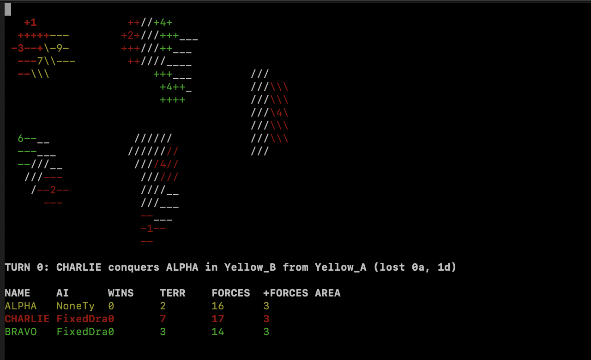
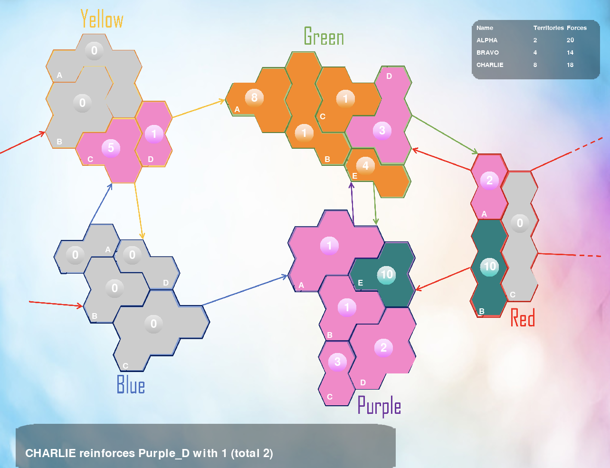

# gym-risk
Gym environment for the risk game by hasbro, so far quite basic and unstable
can be installed by "python setup.py install" 

The code has been extended from the base repo - https://github.com/leoandeol/gym-risk

# Installation
The risk game is setup with 5 continents and 21 territories in total.
Three players can play the game with ALPHA being the RL agent, the other two agents BRAVO and CHARLIE are AI agents. 

We provide two UIs for the game. The first UI uses curses python programming and can be used using --nopygame command -



The world map for curses programming can be found in the file the world map is defined in the file `Risk_env/gym_risk/envs/game/world.py`

We can setup our risk environment to draft troops according to a RL model or some fixed drafting 
made by humans. We pass a parameter "human_drafting" in our step function for the same. Currently, we have hardcoded some random selections in file `Risk_env/gym_risk/envs/game/deployment_maps.py`. If the 
human_drafting variable is set true, the environment randomly picks a configuration for the given map ans drafts troops
accordingly. 

We provide another UI using pygame and can be used using --nocurses command - 


## Format of Actions
There can be 4 phases in our RISK environment -  
0 - initilaize or draft <br />
1 - reinforce  <br />
2 - attack   <br />
3 - reinforce   <br />

An action is specified by a four-item tuple, i.e. < p,s,t,tr >. 
 1. The first item, p, specifies which type of action is being conducted, among the four possible phases in the game. 
 2. Item two, s, denotes the source country for the action. For reinforce and drafting actions this is the country that the agent wants to add troops to, whereas for the attack and freemove actions, s denotes the country you will be attacking or moving from. 
 3. The, final two items, t and tr, are specifically for attack and move actions. t specifies the country that you would like to attack or move to. For the attack action, tr specifies the number of troops you would like to move from the attacking country if you win the combat. When the agent specifies a move action, tr denotes the number of troops to be moved from s to t.


# Reward Functions

We have provided different types of reward functions in this repo which can be used to train and test on the RISK environment. 
The code for reward functions can be found in the file `Risk_env/gym_risk/envs/reward_functions.py`
There are types of reward functions - 

1) Basic reward function - Provides +100 for winning the game and -100 for losing.
2) Survival based reward function - Provided +1 for every turn it survives and -1 for losing
3) Turn Count -  Provided +1 for every turn it survives and 0 for losing
4) Rules Based - Provides points each for 
   1) a successful action 
   2) finishing a phase
   3) successfully transitioning to the next phase 
   4) defeating a player 
   5) winning thr game
5) Rules Based Legal Actions - It is similar to the previous reward function, the only difference being that no rewards are
provided for successfully transitioning to the next phase because we make sure that the agent takes only legal actions while training.

The weights for each of the rules can be defined in the file `Risk_env/gym_risk/helpers/reward_config.cfg` while training the agent and can be changed accordingly.

# Logging
To enable logging you can use the following statements in the file - 
```
import logging
logging.basicConfig(filename="pyrisk.reward.log", filemode="w")
LOG = logging.getLogger("pyrisk")
LOG.setLevel(logging.INFO)
```

# Usage
After installing the library, the environment can be accessed with the following command
```
env = gym.make('Risk-v0')
```
You can then use it the same way as a regular open-ai gym environment
